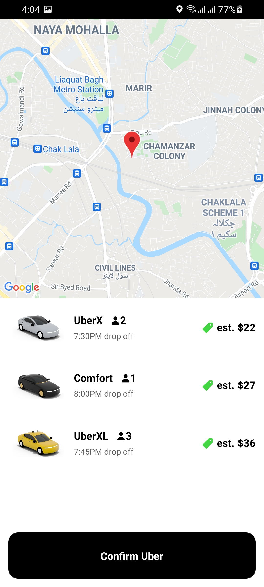

## About The Project

Thi is uber passenger app clone. This repository contains the UI of the application that is built using React Native CLI.

## App UI ScreenShots

<p align="center">

<a>
    
    
    
    
    

</a>
</p>

### Installation

1. Clone the repo
   ```sh
   git clone https://github.com/AsadBaig039/Uber_Clone.git
   ```
2. Install NPM packages

   ```sh
   npm install
   ```

### Run Application

1. go to config folder
2. open API_KEY.js file
3. Enter Your API_KEY (to enable map view and google places services)
4. Open VSCode Terminal

5. Run the Command
   ```sh
   react-native run-android
   ```

## Contact

ASAD BAIG - [asad.baig039@gmail.com](asad.baig039@gmail.com)

Project Link: [https://github.com/AsadBaig039/Uber_Clone.git](https://github.com/AsadBaig039/Uber_Clone.git)

<!-- ACKNOWLEDGEMENTS -->

## Acknowledgements

- [Vector Icons](https://www.npmjs.com/package/react-native-vector-icons)
- [Google developer console API services](https://console.cloud.google.com/apis/)
- [React native Navigation](https://reactnavigation.org/)
